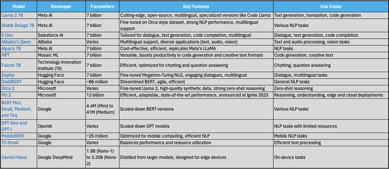

# What are Small Language Models (SLMs)?

Language Models (LMs) are foundation models that combine NLP techniques and AI models to generate a meaningful connection between machines and humans. They are designed to understand, generate and predict human language and usually trained against vast amount of text data to absorb statistical features (sequence of words, grammar, concept) of language to generate contextually relevant outputs at human level. There are a variety of language models in an spectrum from simple N-gram models (for predicting next word in a sequence) to complex transformers (for understanding patterns and dependencies through self-attention mechanism).

SLMs are type of language models that 

* (a) have fewer parameters, there are diverse scales of parameters, but it is often in the range of millions.

* (b) are trained on a smaller dataset compared to LLMs.

* (c) and thus requires less computational power and memory, making them faster and more efficient to run.

* (d) can perform well on specific tasks; but generally have lower performance on complex language understanding/generation in comparison to LLMs.

* (e) have lower risk of algorithmic bias (due to training on not sufficiently diverse data set) and hallucination, ....

SLMs are mostly used when computational resources are limited, for instance in mobile devices, embedded systems, or wherever quick responses are needed. A list of SLMs with some important features of each is avaialble in the enclosed picture (pic ref: table is adopted from [https://lnkd.in/gwBvjzm5])

